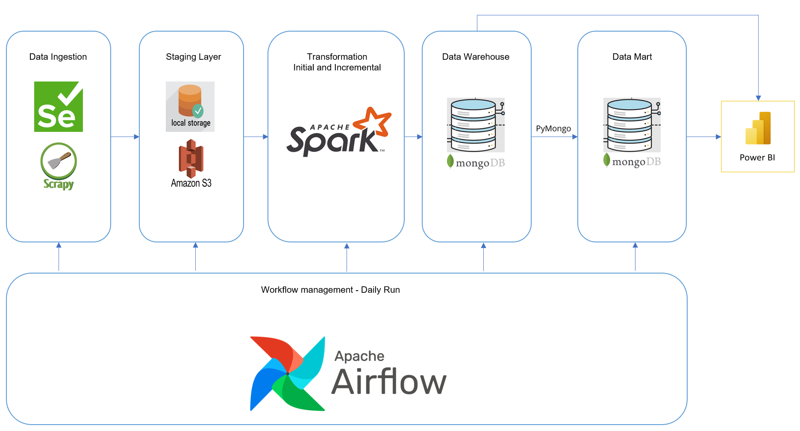

# Men's Clothing Shop Project (Version 1.1)
## I. Project Demo
### 1. Mens's Clothing Shop Dashboard run by Power BI (URL: https://www.novypro.com/project/mens-clothing-shop---daily-update)

### 2. Aiflow Workflow
#### Initial ETL
](<Introduce/Initial ETL.gif>)
#### Incremental ETL

## II. Introduction

### 1. Blueprint

### 2. Summary
Create a daily report for multiple men's clothing shops on an e-commerce website.
Data is automatically gathered from the E-Commerce Website daily, then transferred and loaded into the Data Warehouse and Data Mart. This data is subsequently imported into Power BI to create insightful dashboards.

### 3. More Detail
* Utilize **selenium** and **scrapy** to extract data from the E-Commerce Website. Employ selenium with a designated profile to circumvent repeated sign-ins on the E-Commerce Page (note: cookies are ineffective).

        # set up for driver
        chrome_options = webdriver.ChromeOptions()

        # use selenium with specific profile
        chrome_options.add_argument(f"--user-data-dir=%Path")
        chrome_options.add_argument("--profile-directory=%Your_Profile_Name")

        # to get log from Chrome.
        chrome_options.set_capability('goog:loggingPrefs', {'performance': 'ALL'})

        # Enable network tracking. To get request and response from API
        driver.execute_cdp_cmd("Network.enable", {})

* For the Staging Layer: Store all the scraped data in **local storage** (dynamic path: *year/month/day/file.json*). Then, merge multiple Json files and upload them to S3. *(An alternative method: directly save all the json files into S3 using scrapy, but this could result in numerous put and get requests and incur costs. Since jobs are run daily, instead of uploading 10 files per day to S3, just upload one consolidated file.)*

* Utilize **Spark** to retrieve raw data from **S3**, implement Change Data Capture (a simple method is to use a join statement to combine new data with the old one), transform this data and load it into the Data Warehouse. This process is divided into two distinct steps: Initial ETL and Incremental ETL.

* Both the **Data Warehouse** and **Data Mart** utilize **MongoDB** as their database engines for its high performance. A star schema is employed in the Data Mart, with the fact table include daily revenue (periodic snapshot fact table).

* Use **Power BI** to visualize data. Data will be imported directly from MongoDB. Data is imported directly from MongoDB and is set to refresh automatically on a daily basis. (This is the only option available with a free account.)

* Use **Airflow** for workflow management. Schedule above tasks and run them on a daily basis.

* This project was run on **Ubuntu** (Windows Subsystem for Linux).